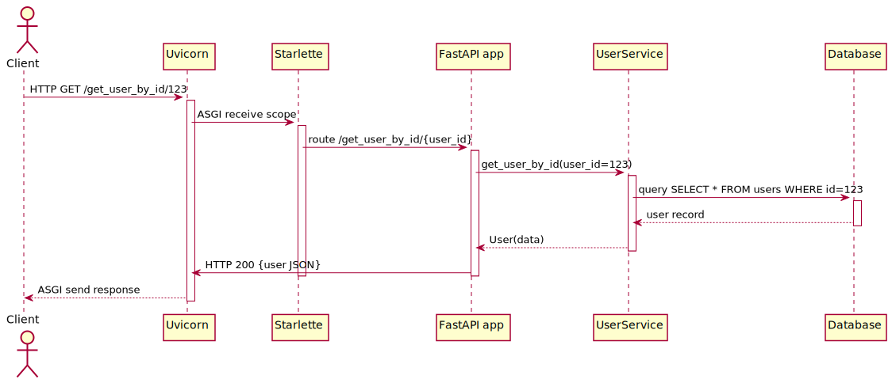

# Data-Backend

## Definition Backend

> Das **Backend** einer Webanwendung (auch „Server Side“ genannt) umfasst alle Komponenten und Prozesse, die auf dem Server laufen, um Client-Anfragen zu verarbeiten, Daten zu speichern und Geschäftslogik auszuführen. Es ist der nicht sichtbare Teil, der Datenmanagement, Anwendungssicherheit und Schnittstellenbereitstellung übernimmt und dem Endnutzer verborgen bleibt

### Hauptbestandteile
- **Anwendungsserver:** Führt serverseitigen Code aus, verarbeitet Anfragen und leitet sie an Module weiter.
- **Datenbank:** Persistente Speicherung und Verwaltung von Applikationsdaten wie Nutzerkonten und Transaktionen
- **APIs:** Strukturelle Endpunkte (REST, GraphQL, gRPC) für die Kommunikation mit dem Frontend.
- **Geschäftslogik:** Kapselt Regeln und Abläufe der Anwendung, z. B. Workflows und Integrationen mit externen Diensten.
- **Authentifizierung & Autorisierung:** Verifiziert Benutzer und legt Zugriffsrechte fest, um unbefugte Aktionen zu verhindern.

### Aufgaben
1. **Anfragen verarbeiten:** Entgegennahme von HTTP-/WebSocket-Requests und Routing zu Endpunkten.
2. **Datenzugriff:** Sichere und performante Lese-/Schreibzugriffe auf Datenbanken oder externe Speichersysteme.
3. **Zustandsmanagement:** Verwaltung von Sessions, Caching und Transaktionen.
4. **Skalierbarkeit & Performance:** Lastverteilung, Caching und asynchrone Verarbeitung für hohe Nutzerzahlen.
5. **Sicherheit:** Schutzmechanismen gegen SQL-Injection, XSS, CSRF und TLS-Verschlüsselung.

## RESTful APIs  
**REST** (Representational State Transfer) ist ein Architekturstil für verteilte Systeme, definiert von Roy Fielding. Seine wichtigsten Prinzipien sind:  
- **Ressourcenorientierung:** Jede Ressource ist unter einer URI erreichbar.  
- **Einheitliche Schnittstelle:** Standardisierte HTTP-Methoden (CRUD) manipulieren Ressourcen.  
- **Zustandslosigkeit:** Jeder Request enthält alle nötigen Informationen; der Server speichert keinen Sitzungszustand.  
- **Optionale Constraints:** Layered System, Caching, Code-on-Demand

Ein **RESTful API** folgt diesen Prinzipien und stellt über definierte Endpoints CRUD-Operationen auf Ressourcen bereit.
Ein **Endpoint** in Anwendungen die auf RESTful APIs setzen, bezeichnet eine klar definierte Kombination aus **URL-Pfad** und **HTTP-Methode**, an die Clients ihre Requests senden, um auf Ressourcen zuzugreifen oder Aktionen auszulösen, mittels:
1. eines **Pfades** (z. B. `/users/{user_id}`)  
2. einer **HTTP-Methode** (GET, POST, PUT, DELETE …)  
3. einer **Handler-Funktion**, die den Request verarbeitet und eine Response generiert

### Gehört ein WebSocket dazu?  
**WebSocket** ist ein eigenständiges, **persistentes** und **bidirektionales** Kommunikationsprotokoll, das nicht dem zustandslosen Request-/Response-Modell von REST folgt.  
- WebSocket-Verbindungen werden nach einem Handshake offen gehalten und ermöglichen Streaming.  
- Da REST auf kurzlebigen, zustandslosen HTTP-Requests basiert, zählen WebSockets **nicht** zu den RESTful APIs, werden aber häufig **ergänzend** eingesetzt, um Use-Cases (z. B. Chat, Telemetrie) zu unterstützen.

## Planen von Endpoints
Wir beginnen damit unsere Dateninteraktionen aus den Use-Cases in Sequence-Diagramme zu übersetzen. Zur Dokumentation und Visualisierung eignet sich hier das Tool PlantUML, welches eine Klasse für Sequence-Diagramme mitliefert. Rendern lassen können wir dieses etwa mit dem `kroki.io` Webservice. 

### Definition der Use-Cases

#### Use Case 1: GET Benutzerprofil

* **Beschreibung:** Der Endpunkt `/get_user_by_id/{user_id}` liefert das Profil eines Benutzers basierend auf der ID. GET-Endpunkte sind sicher und idempotent, da sie keine Zustandsänderungen durchführen. ([blog.postman.com](https://blog.postman.com/rest-api-examples/?utm_source=stemgraph.github.io), [knowi.com](https://www.knowi.com/blog/rest-apis-overview-use-cases-and-useful-information/?utm_source=stemgraph.github.io))
* **Motivation:** Ermöglicht Clients, Benutzerinformationen plattformübergreifend abzurufen. REST-APIs nutzen GET, um Daten plattformübergreifend bereitzustellen. ([document360.com](https://document360.com/blog/what-is-rest-api/?utm_source=stemgraph.github.io), [konghq.com](https://konghq.com/blog/learning-center/what-is-restful-api?utm_source=stemgraph.github.io))

#### Use Case 2: POST Ticket erstellen

* **Beschreibung:** Der Endpunkt `/create_ticket` erstellt mit einem POST-Request ein neues Support-Ticket. POST-Endpunkte erzeugen neue Ressourcen und sind nicht idempotent. ([restfulapi.net](https://restfulapi.net/http-methods/?utm_source=stemgraph.github.io), [stackoverflow.com](https://stackoverflow.com/questions/19637459/rest-api-using-post-instead-of-get?utm_source=stemgraph.github.io))
* **Motivation:** Der Request-Body kann komplexe JSON-Strukturen enthalten, was die Ressourcenanlage flexibel macht. ([knowi.com](https://www.knowi.com/blog/rest-apis-overview-use-cases-and-useful-information/?utm_source=stemgraph.github.io), [help.tableau.com](https://help.tableau.com/current/api/rest_api/en-us/REST/rest_api_concepts_example_requests.htm?utm_source=stemgraph.github.io))

#### Use Case 3: WebSocket Live-Datenstream

* **Beschreibung:** Die Route `/ws/temperature` öffnet eine WebSocket-Verbindung und streamt synchron Sensordaten als Zeitreihe. WebSocket-Verbindungen bleiben persistierend und reduzieren Overhead durch Wegfall von Polling. ([ably.com](https://ably.com/topic/what-are-websockets-used-for?utm_source=stemgraph.github.io), [emily-elim04.medium.com](https://emily-elim04.medium.com/building-real-time-apps-using-websockets-dc137ccdd34b?utm_source=stemgraph.github.io))

* **Motivation:** Ideal für Telemetrie und Monitoring, da sie bidirektionale, voll-duplex Kommunikation ohne ständiges Polling ermöglichen. ([stackoverflow.com](https://stackoverflow.com/questions/60989957/how-to-get-time-series-through-websocket-from-predix?utm_source=stemgraph.github.io), [ably.com](https://ably.com/topic/websocket-architecture-best-practices?utm_source=stemgraph.github.io))

### Darstellung der Use Cases als Sequence-Diagrams
Bevor wir damit starten einen Endpoint zu implementieren, beschreiben wir diesen zunächst als Sequenz. Dazu können wir das Tool `plantuml` nutzen, welches sich mittels `apt` installieren lässt. Im `./assets/`-Directory befindet sich ein `.iuml`-File für jedes Diagramm. Um ein `.svg` daraus zu erstellen kann der folgende Befehl genutzt werden:
```bash
planuml -tsvg ./assets/<diagram>.iuml
```

#### Use Case 1: GET - Benutzerprofil holen




#### Use-Case 2: POST - Ticket erstellen


#### Use-Case 4: WebSocket - Temerpatur-Messung


### Planen der Mock-Daten

> Mock-Daten sind simulierte Beispieldatensätze, die realistische Antworten einer API nachahmen, ohne dass tatsächlich eine Datenbank oder ein externer Dienst angesprochen wird. Sie werden in der Entwicklung verwendet, um Endpoints unabhängig von der Produktionsinfrastruktur zu testen, schneller Feedback zu bekommen und Fehler früher zu erkennen. Durch den Einsatz von Mock-Daten können Entwickler bereits vor Anbindung echter Systeme die Logik, Validierung und Fehlerbehandlung ihrer Endpoints überprüfen und dokumentieren.  

**Beispiele für unsere drei Use-Cases**  
- **GET /get_user_by_id/{user_id}**  
```json
{
    "id": 123,
    "username": "jdoe",
    "first_name": "John",
    "last_name": "Doe",
    "email": "jdoe@example.com",
    "created_at": "2023-08-15T10:55:30Z",
    "roles": ["user", "admin"]
}
```

* **POST /create\_ticket**

```json
{
    "user_id": 123,
    "title": "Login-Problem",
    "description": "Ich kann mich nicht anmelden, Fehler 403.",
    "priority": "high",
    "tags": ["auth", "login"]
}
```
* **WebSocket /ws/temperature** (Stream-Nachrichten alle 30 Sekunden)

```json
  { "timestamp": "2025-05-12T14:31:00Z", "value": 22.5 }
```


## Umsetzung eines Data-Backends mit FastAPI
> **FastAPI** baut auf dem Starlette-Framework auf und stellt eine von Starlette abgeleitete ASGI-kompatible Applikationsklasse namens `app` bereit, die Endpunkt-Definitionen, Datenvalidierung via Pydantic und automatische OpenAPI-Dokumentation integriert. **Uvicorn** ist ein ASGI-Server, der HTTP- und WebSocket-Anfragen entgegennimmt und sie über das ASGI-Protokoll als Event-Streams an eine ASGI-Anwendung weiterleitet, in diesem Fall **FastAPI**. 

**ASGI (Asynchronous Server Gateway Interface)**
FastAPI basiert auf dem ASGI-Standard, der eine asynchrone Schnittstelle zwischen Web-Servern und Python-Frameworks definiert. ASGI ermöglicht es, Anfragen nicht-blockierend zu verarbeiten und damit hohe Parallelität sowie WebSockets- und HTTP/2-Unterstützung zu realisieren.

### Wie Uvicorn Anfragen an Starlette weitergibt

1. **Uvicorn** startet einen ASGI-Server auf Basis von uvloop und httptools. Er bindet an einen Port und empfängt HTTP- und WebSocket-Anfragen auf dem Netzwerk-Socket.

2. Uvicorn wandelt eingehende HTTP-Daten in das ASGI-Protokoll-Format um und ruft die `__call__`-Methode der konfigurierten ASGI-App (hier Starlette, respektive FastAPI) auf.

3. **Starlette** übernimmt die Anfrage in Form eines ASGI-Scope-Dictionaries:

   1. **Middleware-Verarbeitung**: Starlette iteriert durch eine konfigurierbare Middleware-Kette. Jede Middleware kann eingehende Requests vorverarbeiten (z.B. Authentifizierung, CORS-Header, Logging) und auf dem Rückweg Responses bearbeiten. Middleware-Implementierungen nutzen asynchrone Hooks (`__call__`, `dispatch`), um nicht-blockierend zu arbeiten.
   2. **Routing**: Nach der Middleware-Pipeline löst Starlette den passenden Route-Handler auf Basis von Pfad- und Methodendefinitionen. Es durchsucht die Router-Bäume, unterstützt Pfadparameter (`/items/{item_id}`), Query-Parameter und kann Sub-Router (via `include_router`) verschachteln.
   3. **Endpoint-Aufruf**: Ist der Handler ermittelt, ruft Starlette den asynchronen oder synchronen Endpunkt auf und übergibt das Request-Objekt mit validierten Pfad- und Query-Parametern.

4. Die Antwort wird als ASGI-Nachrichten (http.response.start, http.response.body) zurückgegeben und Uvicorn schickt sie an den Client.

### Rolle von Pydantic und Bedeutung von Typsicherheit
FastAPI nutzt Pydantic, um Request- und Response-Daten zu validieren und zu serialisieren:

* **Deklarative Modell-Definition**: Mit Pydantic definieren wir Python-Klassen, die Datenschemas repräsentieren. Typannotationen beschreiben Feldtypen, Default-Werte und Constraints.
* **Automatische Validierung**: Eingehende JSON-Daten werden beim Entrypoint gegen Pydantic-Modelle geprüft. Falsche oder fehlende Felder führen zu einem sofortigen 422-Fehler.
* **Serialisierung**: Antworten werden anhand der Pydantic-Modelle in JSON umgewandelt, wobei Typen korrekt serialisiert werden.

**Warum Typsicherheit wichtig ist**

1. **Fehlerfrüherkennung**: Ungültige Eingaben werden sofort abgefangen, bevor Business-Logik ausgeführt wird.
2. **Dokumentation & Autovervollständigung**: Typannotations helfen Editoren, Code-Completion und erzeugen aussagekräftige OpenAPI-Schemas.
3. **Wartbarkeit**: Klar definierte Schnittstellen sorgen für weniger Überraschungen beim Refactoring.
4. **Performance**: Pydantic nutzt effiziente C-Optimierungen für Parsing und Serialisieren.

#### Beschreibung der Datentypen in pydantic

```python
# Im Projekt eine eigene Datei namens models.py
from pydantic import BaseModel

# Use Case 1: GET /get_user_by_id/{user_id}
class User(BaseModel):
    id: int
    username: str
    first_name: str | None = None
    last_name: str | None = None
    email: str
    created_at: str
    roles: list[str]

# Use Case 2: POST /create_ticket
class TicketCreate(BaseModel):
    user_id: int
    title: str
    description: str
    priority: str
    tags: list[str]

class Ticket(BaseModel):
    id: int
    user_id: int
    title: str
    description: str
    priority: str
    tags: list[str]
    status: str
    created_at: str

# Use Case 3: WebSocket /ws/temperature
class TemperatureSample(BaseModel):
    timestamp: str
    value: float
```

### Implementierung der FastAPI Endpunkte gemäß der Sequenzen und Models

```bash
# Projektstruktur
.
├── Dockerfile
├── pyproject.toml       # Für packaging
├── README.md            # Kein Projekt ohne README.md
└── app
    ├── main.py          # FastAPI Application
    └── models.py        # Pydantic-Modelle
```

```python
# app/models.py
from pydantic import BaseModel
from typing import List, Optional
from datetime import datetime

class User(BaseModel):
    id: int
    username: str
    first_name: Optional[str] = None
    last_name: Optional[str] = None
    email: str
    created_at: datetime
    roles: List[str]

class TicketCreate(BaseModel):
    user_id: int
    title: str
    description: str
    priority: str
    tags: List[str]

class Ticket(TicketCreate):
    id: int
    status: str
    created_at: datetime

class TemperatureSample(BaseModel):
    timestamp: datetime
    value: float
```

```python
# app/main.py
from fastapi import FastAPI, HTTPException, WebSocket, WebSocketDisconnect
from fastapi.responses import JSONResponse
import uvicorn
from datetime import datetime
import threading, time, math
import asyncio
from app.models import User, TicketCreate, Ticket, TemperatureSample

app = FastAPI()

# In-Memory Mock-Daten
mock_users = {
    123: User(
        id=123,
        username="jdoe",
        first_name="John",
        last_name="Doe",
        email="jdoe@example.com",
        created_at=datetime.utcnow(),
        roles=["user", "admin"]
    )
}
mock_tickets: list[Ticket] = []

def get_ticket_id() -> int:
    return len(mock_tickets) + 1

# Use Case 1: GET Benutzerprofil
@app.get("/get_user_by_id/{user_id}", response_model=User)
def get_user(user_id: int):
    user = mock_users.get(user_id)
    if not user:
        raise HTTPException(status_code=404, detail="User not found")
    return user

# Use Case 2: POST Ticket erstellen
@app.post("/create_ticket", response_model=Ticket, status_code=201)
def create_ticket(ticket: TicketCreate):
    new_id = get_ticket_id()
    new_ticket = Ticket(
        id=new_id,
        status="open",
        created_at=datetime.utcnow(),
        **ticket.dict()
    )
    mock_tickets.append(new_ticket)
    return new_ticket

# Use Case 3: WebSocket Temperatur-Stream
buffer: dict = {'timestamp': datetime.utcnow(), 'value': 0.0}

def periodic_measure():
    while True:
        buffer['timestamp'] = datetime.utcnow()
        buffer['value'] = 20.0 + 5.0 * math.sin(time.time() / 30)
        time.sleep(1)

threading.Thread(target=periodic_measure, daemon=True).start()

@app.websocket("/ws/temperature")
async def temp_stream(ws: WebSocket):
    await ws.accept()
    try:
        while True:
            sample = TemperatureSample(
                timestamp=buffer['timestamp'],
                value=buffer['value']
            )
            # JSON serialisiert datetime korrekt
            await ws.send_text(sample.json())
            await asyncio.sleep(30)
    except WebSocketDisconnect:
        await ws.close()

# Starte Uvicorn, wenn direkt ausgeführt
if __name__ == "__main__":
    uvicorn.run("app.main:app", host="0.0.0.0", port=80, reload=True)
```

```toml
# pyproject.toml
[build-system]
requires = ["setuptools","wheel"]
build-backend = "setuptools.build_meta"

[project]
name = "fastapi_app"
version = "0.1.0"
dependencies = [
    "fastapi",
    "uvicorn",
    "pydantic"
]

[tool.setuptools.packages.find]
where = ["app"]
```

```dockerfile
# Dockerfile
FROM python:3.12-slim
WORKDIR /app
COPY pyproject.toml ./
RUN pip install --no-cache-dir .
COPY app/ ./app
EXPOSE 80
CMD ["uvicorn", "app.main:app", "--host", "0.0.0.0", "--port", "80"]
```

### Hinweise zur Ausführung

1. **Lokaler Start**

   * Mit Uvicorn:  `uvicorn app.main:app --host 0.0.0.0 --port 80`
   * Direkt:       `./env/bin/python app/main.py`
2. **Docker**

   ```bash
   docker build -t fastapi_app .
   docker run -p 80:80 fastapi_app
   ```
3. **Einzelne EXE**

   * Mit PyInstaller:  `pyinstaller --onefile --name fastapi_app app/main.py`
   * Danach: `./dist/fastapi_app`


## API-Testing mit cURL und Automatisierung mit pytest

Nun wollen wir die zuvor erstellte FastAPI-Anwendung manuell mit **cURL** testen und anschließend mit **pytest** automatisierte Tests implementiert.

---

### Manuelles Testen mit cURL

#### Voraussetzungen
- Die API läuft lokal unter `http://localhost:80` (oder passend zu eurem Setup).
- Installiertes cURL (Version ≥7.0). Überprüfen mit:
```bash
curl --version
```

#### GET Endpoint `/get_user_by_id/{user_id}`

Ruft das Benutzerprofil ab:

```bash
curl -i \
  -X GET "http://localhost:80/get_user_by_id/123" \
  -H "Accept: application/json"
```

* `-i` zeigt Header-Informationen.
* `Accept` spezifiziert erwartetes Format.

#### POST Endpoint `/create_ticket`

Legt ein neues Ticket an:

```bash
curl -i \
  -X POST "http://localhost:80/create_ticket" \
  -H "Content-Type: application/json" \
  -d '{
        "user_id": 123,
        "title": "Login-Problem",
        "description": "Kann mich nicht anmelden.",
        "priority": "high",
        "tags": ["auth","login"]
      }'
```

* `Content-Type: application/json` für JSON-Body.
* `-d` übergibt den Request-Body.

#### WebSocket `/ws/temperature`

Teste den Temperatur-Stream mit `websocat` (Alternativ zu cURL):

```bash
websocat ws://localhost:80/ws/temperature
```

* Gibt alle 30s JSON-Nachrichten aus.

---

### Automatisierung mit pytest

#### Projektstruktur für Tests

```text
app/
  ├── main.py
  ├── models.py
tests/
  ├── test_api.py
pytest.ini
```

#### Test-Setup in `tests/test_api.py`

```python
import pytest
from fastapi.testclient import TestClient
from app.main import app

client = TestClient(app)

# 2.3 Tests für GET
def test_get_user_success():
    response = client.get("/get_user_by_id/123")
    assert response.status_code == 200
    data = response.json()
    assert data["id"] == 123
    assert "username" in data

def test_get_user_not_found():
    response = client.get("/get_user_by_id/999")
    assert response.status_code == 404

# 2.4 Tests für POST
@pytest.fixture
def ticket_payload():
    return {
        "user_id": 123,
        "title": "Test-Ticket",
        "description": "Testbeschreibung",
        "priority": "low",
        "tags": ["test"]
    }

def test_create_ticket(ticket_payload):
    response = client.post("/create_ticket", json=ticket_payload)
    assert response.status_code == 201
    data = response.json()
    assert data["id"] is not None
    assert data["status"] == "open"

# 2.5 Test für WebSocket
import queue
import threading
from websockets import connect

@pytest.mark.asyncio
async def test_ws_temperature():
    uri = "ws://localhost:80/ws/temperature"
    # WebSocket-Handschlag mit async with
    async with connect(uri) as websocket:
        msg = await websocket.recv()
        data = json.loads(msg)
        assert "timestamp" in data
        assert isinstance(data["value"], float)
```

#### pytest-Konfiguration (`pytest.ini`)

```ini
[pytest]
asyncio_mode = auto
python_files = tests/*.py
```

#### Ausführen der Tests

```bash
pytest --maxfail=1 --disable-warnings -q
```

**Hinweis:** Stelle sicher, dass die FastAPI-Anwendung in einem separaten Prozess oder Thread gestartet ist, bevor du den WebSocket-Test ausführst.

